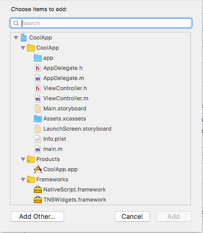
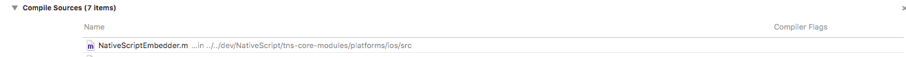

# Embedding NativeScript in an iOS application

We are going to assume you have all the required NativeScript tools installed, if you do not -- you need to follow the instructions at [http://docs.nativescript.org/](http://docs.nativescript.org/) to install the typical NativeScript tools.

Embedding NativeScript inside an existing iOS application requires a little bit of prep work, and if you look at this documentation, it seems like it might be hard to do. However, most of this is really straight forward and easy to do. And the nice thing about some of this prep work is you can re-use a chunk of the prep work to modify and test your NativeScript application outside of your primary app very easily and not have to do it again.

### Your XCode CoolApp!
Let's say your native Xcode based ObjC application is called *CoolApp*. My recommendation to simplify things is to install the NativeScript application near it; and if possible in the same folder that contains your *CoolApp* folder.  The reason for this is that you have to copy or link stuff from your NativeScript app into your *CoolApp* and so it is a lot easier to link to files when they are near each other.  This is not a requirement, just a suggestion to simplify things.  


### Setting up NativeScript

So the first thing you need is to create a NativeScript application.

In a Terminal shell, in the folder that contains the *CoolApp*.

```tns create nsapp```

Optionally you can also use the parameter **--ng** to create an Angular application or **--ts** to create TypeScript application; by default it will create a JavaScript application. Once you have a NativeScript application created, all your source code is in the **nsapp/app folder**.  Please see the [documentation](http://docs.nativescript.org) for any details on how to work with the source code for your NativeScript application.

So your directory should look something like this.

 

The next thing you should do is add the ios platform to the *nsapp* project.

```
cd nsapp
tns platform add ios
```

And finally you need to build the app so you are ready to embed the parts of *nsapp* into your *CoolApp* that you need.

```tns build ios```

> Please note, anytime you make changes to the NativeScript app, you need to rebuild the NativeScript app with the `tns build ios` command.

Now assuming you have all this done correctly, you are now ready to embed the *nsapp* into  *CoolApp*.  Most of these steps you only have to do once and you shouldn't have to perform them again for the *CoolApp*.

### Configuring your Xcode app.

You next need to copy or (preferably) symlink `/nsapp/platforms/ios/internal` to `/coolapp/internal`.

This folder is needed for part of the building steps. I recommend you symlink this as when this folder gets updated with later versions you don't have to re-copy anything. 

Now it should look like this. **Internal** is now a symlink in your *CoolApp* folder.


#### Build Settings Tab

Since we have the linking part done, the rest of it needs to be done in Xcode. Open up your *CoolApp* Xcode project file, click on the `Root Project` node, click the `Build Settings` tab, and then click on the `All` filter.

Scroll down (or type in the filter) to the `Other Linker Flags`.  Open it up, and add this to both Release and Debug branches;

```
-sectcreate __DATA __TNSMetadata "$(CONFIGURATION_BUILD_DIR)/metadata-$(CURRENT_ARCH).bin" $(inherited)
```

So it should look like this:

 

Next scroll down (or type in the filter) to the `Framework Search Paths`. And then open it up and add this to both Release and Debug Branches.

```
$(inherited) $(PROJECT_DIR) $(PROJECT_DIR)/internal $(PROJECT_DIR)/../nsapp/node_modules/tns-core-modules-widgets/platforms/ios
```

 

The first two you may already have, but the others are important: `$(PROJECT_DIR)/internal` as this points to that **Internal** folder that we copied, and it contains **NativeScript.framework**, so we need to make sure Xcode can find it. The last one links to where your *nsapp* is located and goes to where the widgets framework is locate: `/nsapp/node\_modules/tns-core-modules-widgets/platform/ios`

Finally you need to scroll down to find **Enable Bitcode** , or type Bitcode in the search, and then set it to **No**.

#### Build Phases Tab

Now click the `Build Phases` tab. Open up the `Link Binary with Libraries`, and click the `+` button.

 

- Click the `Add Other...` button.

 

- Click on`nsapp` -&gt; `node_modules` -&gt; `tns-core-modules-widgets` -&gt; `platforms` -&gt; `ios` -&gt;`TNSWidgets.framework`

 

- Click on `Link Binary with Libraries` and the `+` button again.
- Click the `Add Other...` button.
- Click on `CoolApp` -&gt; `Internal` -&gt; `NativeScript.framework`

 

We have now added the files we need to link to, now we need to have Xcode embed them into our app.

#### Adding Build Phases

We need to hit the `+` button at the top of the screen:


Choose `New Copy Files Phase`.

You should then see a new section called **Copy Files**. Double click on the `Copy Files` title and rename it to **Embed Frameworks**, so you know what it is in the future.

Click on the `+` in the **Embed Frameworks** area, and then add the `TNSWidgets.framework`.

Click again on the `+` in the **Embed Frameworks** area, and then add the `NativeScript.framework`.

 

After you have added the two frameworks, click on the `Destination` and choose **Frameworks**.

 
 
#### Creating Metadata

NativeScript requires metadata to understand how to talk to the native frameworks. We need to add one more step to automatically generate the metadata during the build process.  
 
Again click the `+` button at the top of the **Build Phases** screen and choose `New Run Script Phase`.

Double click on `Run Script` and rename it to  **Create NativeScript Metadata**.  Then **drag and drop** it up into the second location in the list (underneath `Target Dependencies`.

 
 
Click into the script box, and paste in:

```
cd "$PROJECT_DIR/internal/metadata-generator/bin" && ./build-step-metadata-generator.py
```

 
 
Awesome, we are now done with all the setup. The application should compile with NativeScript embedded and your code (the app/ folder) embedded also.

**All the prep work has been completed!**

## Code Editing

> The exact steps you'll need to take in the next few sections will depend on your specific application. This article will use the sample *CoolApp* project [in this repository](https://github.com/NativeScript/sample-ios-embedded) to demonstrate the steps.

In our sample *CoolApp*, we have the default **AppDelegate.h** &amp; **AppDelegate.m**. We don't need to change anything in these files.    We also have a **ViewController.m** and **ViewController.h**. For this example; I added

	(IBAction)activateNativeScript:(id)sender;

...to the **@interface**; as I needed to be able to trigger it as a button in my Main.storyboard, which I added a button that triggers the **activateNativeScript** function.

However, feel free to implement the code how you need to. This function and all the rest of the interface to NativeScript is in the **ViewController.m**.  This is the only "native" side file you need to worry about. 

The first thing you need to add to your Controller are the following Header files:

```
#import <NativeScript/NativeScript.h>           // NativeScript header itself
#import <JavaScriptCore/JavaScript.h>           // JavaScriptCore code
#import <JavaScriptCore/JSStringRefCF.h>        // JavaScriptCore strings
```

The first two headers are needed to send stuff into the NativeScript engine. The last header allows us to create JavaScript strings, which is what we will be sending into the engine.

The next thing we do is create a reference that will hold our NativeScript engine reference. So inside the **@Implementation** I added:

```TNSRuntime *_runtime;```

Now in the sample *CoolApp*, I have a couple additional variables.  However, they are just to make the demo cooler, they don't serve any purpose for dealing with the engine.

In the `ViewDidLoad`, I add:

`[self _initializeRuntime];`

This function is a self contained function to initialize the entire engine, you need to do this once for your application.  Copy and paste the entire `\_initializeRuntime` to your code; and call it before you need to use the NativeScript engine.

```
- (void)_initializeRuntime {
    // The linker-embedded NativeScript meata.
    extern char startOfMetadataSection __asm("section$start$__DATA$__TNSMetadata");

    // You need to call this method only once in your app.
    [TNSRuntime initializeMetadata:&startOfMetadataSection];

    // Tell NativeScript where to look for the "app" folder.
    _runtime = [[TNSRuntime alloc] initWithApplicationPath:[[NSBundle mainBundle] bundlePath]];

    // Schedule the runtime on the runloop of the thread you'd like promises and other microtasks to run on.
    [_runtime scheduleInRunLoop:[NSRunLoop currentRunLoop] forMode:NSRunLoopCommonModes];

    // This enables NativeScript Logging to the Console (Optional)
    [TNSRuntimeInspector setLogsToSystemConsole:YES];
}
```

Your init code should look almost exactly like this; don't change anything here unless you understand what they do. If you do, it could easily break your ability to use the NativeScript engine.

The next function you should copy and add to *CoolApp* is the `\_runScript` function. I wrote this function to encapsulate the entire process to convert a `NSString` into a `JSString` and to send it into the engine and run it as JavaScript code.

```
- (void)_runScript: (NSString *)source {
    JSValueRef error = NULL;
    
    JSStringRef script = JSStringCreateWithCFString((__bridge CFStringRef)(source));
    JSEvaluateScript(_runtime.globalContext, script, NULL, NULL, 0, &error);
    JSStringRelease(script);

    if (error) {
        JSStringRef stringifiedError = JSValueToStringCopy(_runtime.globalContext, error, NULL);
        NSLog(@"Error: %@", JSStringCopyCFString(kCFAllocatorDefault, stringifiedError));
        JSStringRelease(stringifiedError);
        return;
    }
}
```

As you can see, the **\_runScript** is fairly simple. It takes a `NSString`, convert it to a `JSString`, use the `JSEvaluateScript`, and tell it which context to use and pass in our script. It next frees the memory for the created `JSString`, and checks to see if there are any errors and log them to the console.

Finally we will look at the **activateNativeScript** function; this really is a very simple function. In my source, I have it actually run a couple different sets of different code to the NativeScript engine, to give you a better feel of how it works. But here in the article we are only going to show one example.

```
- (void)activateNativeScript:(id)sender {
    NSString *source = @"var application = require('application');"
    "application.start({ moduleName: 'main-page' });";
    
    [self _runScript: source];
}
```

Whoa, is it really that simple?  Yes sir! You basically `require('application')`, and you launch the screen you want.  So if you look in the source code in the full example you will see I actually use several different pages and call other items in the engine.  You can set which page you want to activate with that `moduleName` parameter, and you can also pass parameters to a screen via a added `context` parameter to the `application.start` command.

Now the above sample is pure NativeScript, if you prefer using Angular, then the code is very similar and would look like this.

```
- (void)activateNativeScript:(id)sender {
    NSString *source = @"var platform = require('nativescript-angular/platform');"
         "var AppModule = require('./app.module' });"
         "platform.platformNativeScriptDynamic().bootstrapModule(AppModule);";

    [self _runScript: source];
}
```

The `AppModule` is your Angular code.  This is what launches your Angular application/screen.  Now, one thing to understand is that you are probably a lot better off using a pure NativeScript over Angular.  The startup speed of Angular is a lot slower, but it is a valid option.

**You are now ready to rock and roll!**

## Additional Advice 

Bet you thought I was done, didn't you? Well, I have some more great advice! And some tips on how to deal with certain things you might want to do in your newly embedded NativeScript screens.

#### Always Rebuild After Changes to NativeScript Code!
Any changes you do to the source code in your /nsapp/app (and sub-folders) you really must do a `tns build ios`.  This way all changes are built properly into the `/nsapp/platforms/ios/nsapp/app` folder that you linked your *CoolApp* to. This is especially important if you are using TypeScript as you need to have the compiled JS files for NativeScript.

#### Use a Pure NativeScript App for Testing
The next piece of advice is that you should test everything inside a NativeScript application. It really will make your development faster with the built in LiveSync ability.  You can easily make a &quot;menu-page&quot; have just a bunch of buttons that launch each of your sub-screens that you plan on calling from your CoolApp.  This way you can test the functionality of each screen inside your NativeScript app easily.

#### _runScript
You can use the `_runScript` function to send data into the page when it is created; so that when you launch the page you can pass any data the page needs from your native app while it is running.  For example, you can pass the user's name or other data that makes the page customized for the user.

In addition while the NativeScript page/app is still running, you can use `_runScript` to send even more data and/or run other things on the active page. Remember JS is single threaded, so if it is already busy, it will ignore it until it has time to handle your new `_runScript` request. This is also how you can easily communicate from your *CoolApp* into your NativeScript part of the application.

#### Two-Way Communication

As we discussed above, `_runScript` is the method to send data into NativeScript. Communication back from NativeScript to the Native app can be done a couple ways. One, you can use the Global variable and set it; then read it from the Native Application (an example is provided in the sample source). This is very hacky, but might be useful in some cases to get/set a variable you might need to track at different points of time.

The better way to communicate though is to create a Notification system. Basically NativeScript calls your Noification class with its values; and the rest of your application listens for the events, when the event occurs your app reacts to it.  So in this sample app I implemented a two way communication channel. In the `ViewController._initializeRuntime` I added:

```
   [[NSNotificationCenterdefaultCenter] addObserver:self
                                        selector:@selector(receiveNativeScriptNotification:
                                        name: "NativeScriptNotification"
                                        object:nil];
```

This is used to register a notification that will receive "NativeScriptNotification"; events. You can name it whatever you want, or multiple names. Then I added the function 
`receiveNativeScriptNotification`
```
- (void) receiveNativeScriptNotification:(NSNotification *) notification

{
    if ([[notification name] isEqualToString:@&quot;NativeScriptNotification&quot;]) {
        NSDictionary \*userInfo = notification.userInfo;
        NSString \*value = [userInfo objectForKey:@"result"];
        NSLog (@"Successfully received %@ from NativeScript!", value);
    }
}
```
Now in this code, I double check the name to make sure it is our specific notification. This isn't needed as our code base above only has one notification type. However, I show you it to future proof it as you can actually have one listener listen to multiple different events and handle them each separately or together by checking the notification event name.   

The key part of this routine is the `NSString *value` code.   This technique allows you to receive any results you want via a dictionary (meaning you can also pass multiple items back in a single message). On the NativeScript side the code is also very simple. For getting a message the routine basically this:

```
global.messageFromNative = function(data) {
    var cmd = JSON.parse(data);

   // Do whatever with the cmd JSON parameters
}
```

And then to send a message back to the Native iOS code the routine is this:

```
global.messageToNative = function(message) {
    var utils = require('utils/utils');
    var center = utils.ios.getter(NSNotificationCenter, NSNotificationCenter.defaultCenter);
    var dataDictionary = NSDictionary.dictionaryWithObjectForKey(message, &quot;result&quot;);
    center.postNotificationNameObjectUserInfo(&quot;NativeScriptNotification&quot;, null, dataDictionary);
}
```

I get the same application-wide default notification center, create the Dictionary with the value(s) I want to send back, and then post the message with my dictionary.

## Cocoapods

Any Cocoapod that works in your *CoolApp*, should work fine in NativeScript; in fact a large number of the NativeScript plugins for iOS are Cocoapods underneath. If you already use Cocoapods you understand how to add them to your *CoolApp*.  

In NativeScript they are generally automatically added as part of the plugin installation. After you build your *nsapp*; you will want to navigate to the **/nsapp/platforms/ios** and copy all the `Pod` values out of the generated **Podfile** into your own *CoolApp* Podfile, that way you get any of the additional Cocoapods that your NativeScript part of your app uses.  
 
In the example app I use the `nativescript-drawing` plugin, which uses a Cocoapod to show you how it works. If you haven't ever used Cocoapod, then it is only a little bit more work.  Instead of copying the text out of the Cocoapod, you will want to copy the entire `Podfile` from that *nsapp* directory, to *CoolApp* project into the exact same directory that contains your `CoolApp.xcodeproj` file.

 
 
 Then you need to edit it and change the **target** to say &quot;*CoolApp*&quot;.

 

Once that is done you type `pod install` in that same folder. It will download and setup everything needed for Cocoapod support.  From now on out you **ONLY** open up the newly created `CoolApp.xcworkspace` as it will be the full project that is all setup for using Cocoapods.

#### Exiting from Running NativeScript Back to Native CoolApp

To close the NativeScript portion of the app and return back to your Native App you need to call:

`DismissViewControllerAnimated:(BOOL)flagcompletion:(void (^)(void))completion;`

From inside NativeScript the code looks like this:

```
 var window = application.ios.nativeApp.keyWindow || (application.ios.nativeApp.windows.count > 0 && application.ios.nativeApp.windows[0]);

  if (window) {
        var rootController = window.rootViewController;
        if (rootController) {
            rootController.dismissViewControllerAnimatedCompletion(true, null);
        }
   }
```

## The NativeScriptEmbedderDelegate protocol
NativeScript 4.2.0 gives embedders more control over the NativeScript application using the *NativeScriptEmbedder* class and the *NativeScriptEmbedderDelegate* protocol. In order to take advantage of them you need to do few additional steps:

1. Add *tns-core-modules* **src** folder to your **Header Search Paths**:

```
$(PROJECT_DIR)/../nsapp/node_modules/tns-core-modules/platforms/ios/src
```
2. Add  **NativeScriptEmbedder.m** file to **Compile Sources**(*Build Phases -> Compile Sources*)

 
 
3. Update the class you want to get a reference to the NativeScript app *rootViewController* to conform to the **NativeScriptEmbedderDelegate** protocol. For example:

```
@interface ViewController () <NativeScriptEmbedderDelegate>

@end
```

4. Register the delegate (e.g. in **viewDidLoad**):

```
[NativeScriptEmbedder sharedInstance].delegate = self;
```

5. Implement **NativeScriptEmbedderDelegate** protocol's **presentNativeScriptApp:** method:

```
- (id)presentNativeScriptApp: (UIViewController*) vc {
    [self addChildViewController:vc];
    [vc.view setFrame:_containerView.bounds];
    [_containerView addSubview:vc.view];
    [vc didMoveToParentViewController:self];
    return 0;
}
```
Here **_containerView** is the view we want to add our NativeScript app to and **vc** is the embedded app's *rootViewController*.

>Note that **presentNativeScriptApp:** method returns **0**. This is required due to a limitation in the current runtime's logic.


## Go Forth and Embed!

Now that you have read the entire HOWTO, you should have a pretty good idea how to embed NativeScript in an existing native iOS app. It may seem overwhelming, but it is fairly simple to get working. In addition we covered how to make your app communicate back and forth between NativeScript and your native portions of the application.  
